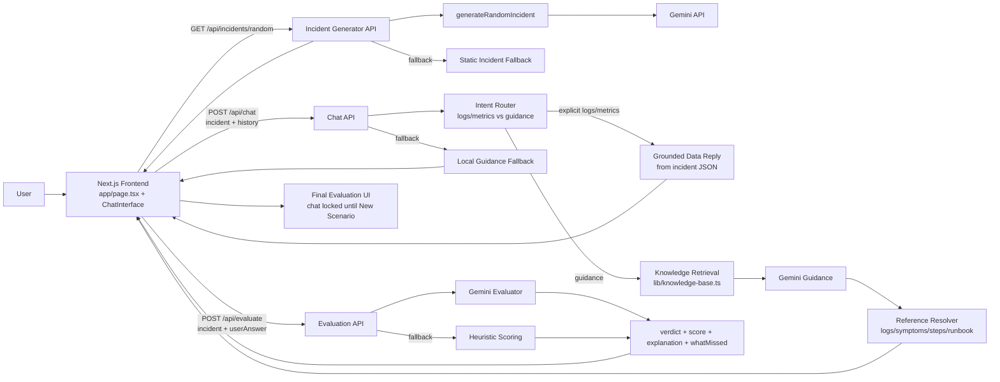
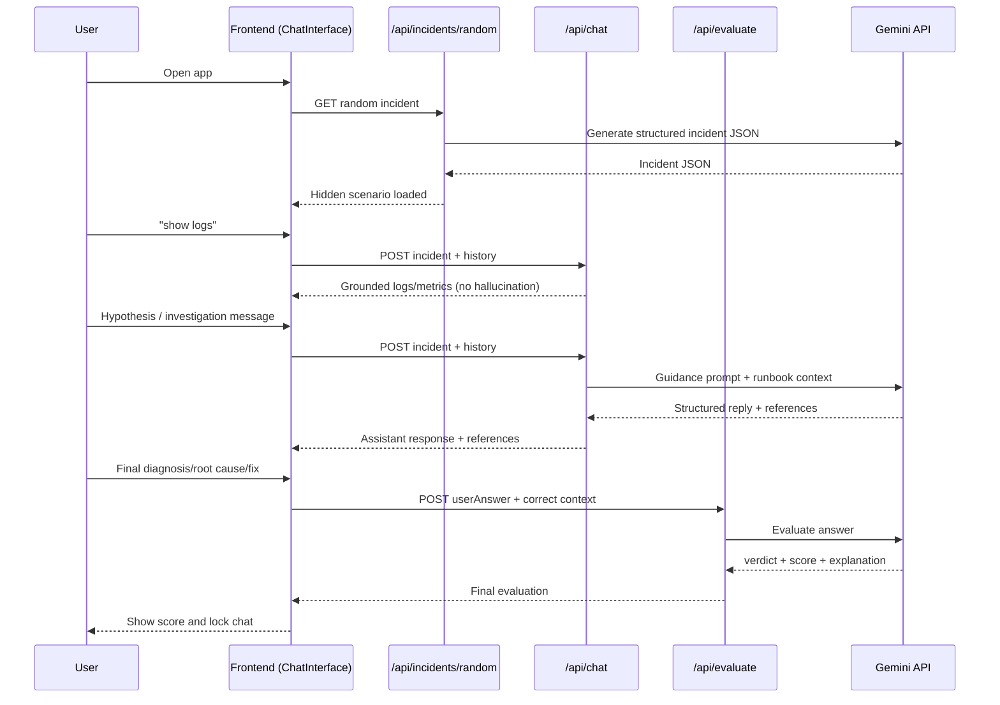

# OnCall Mentor Architecture Diagram

```mermaid
flowchart LR
    U[User] --> UI[Next.js Frontend<br/>app/page.tsx + ChatInterface]
    UI -->|GET /api/incidents/random| RND[Incident Generator API]
    RND --> GEN[generateRandomIncident]
    GEN --> GEM[Gemini API]
    RND -->|fallback| FB1[Static Incident Fallback]
    RND --> UI

    UI -->|POST /api/chat<br/>incident + history| CHAT[Chat API]
    CHAT --> INTENT[Intent Router<br/>logs/metrics vs guidance]
    INTENT -->|explicit logs/metrics| GROUND[Grounded Data Reply<br/>from incident JSON]
    INTENT -->|guidance| RETRIEVE[Knowledge Retrieval<br/>lib/knowledge-base.ts]
    RETRIEVE --> CHAT_GEM[Gemini Guidance]
    CHAT_GEM --> REF[Reference Resolver<br/>logs/symptoms/steps/runbook]
    CHAT -->|fallback| FB2[Local Guidance Fallback]
    GROUND --> UI
    REF --> UI
    FB2 --> UI

    UI -->|POST /api/evaluate<br/>incident + userAnswer| EVAL[Evaluation API]
    EVAL --> EVAL_GEM[Gemini Evaluator]
    EVAL -->|fallback| EVAL_FB[Heuristic Scoring]
    EVAL_GEM --> SCORE[verdict + score + explanation + whatMissed]
    EVAL_FB --> SCORE
    SCORE --> UI

    UI --> LOCK[Final Evaluation UI<br/>chat locked until New Scenario]
```

## Optional Sequence Diagram (for demo slides)

```mermaid
sequenceDiagram
    participant User
    participant UI as Frontend (ChatInterface)
    participant Inc as /api/incidents/random
    participant Chat as /api/chat
    participant Eval as /api/evaluate
    participant Gemini as Gemini API

    User->>UI: Open app
    UI->>Inc: GET random incident
    Inc->>Gemini: Generate structured incident JSON
    Gemini-->>Inc: Incident JSON
    Inc-->>UI: Hidden scenario loaded

    User->>UI: "show logs"
    UI->>Chat: POST incident + history
    Chat-->>UI: Grounded logs/metrics (no hallucination)

    User->>UI: Hypothesis / investigation message
    UI->>Chat: POST incident + history
    Chat->>Gemini: Guidance prompt + runbook context
    Gemini-->>Chat: Structured reply + references
    Chat-->>UI: Assistant response + references

    User->>UI: Final diagnosis/root cause/fix
    UI->>Eval: POST userAnswer + correct context
    Eval->>Gemini: Evaluate answer
    Gemini-->>Eval: verdict + score + explanation
    Eval-->>UI: Final evaluation
    UI-->>User: Show score and lock chat
```
